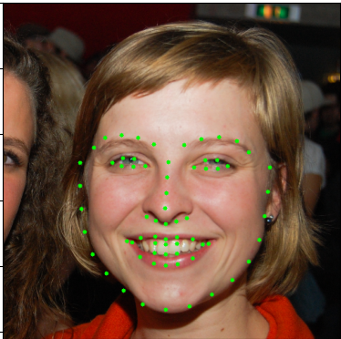

# Описание
Этот проект направлен на детектирование номерных знаков автомобилей с использованием фреймворка YOLOv11,
а также проводит ablation study (анализ влияния различных компонентов модели).

# Содержание
- [Функции](#Функции)
- [Датасет](#Датасет)
- [Установка](#Установка)
- [Обучение](#Обучение)
- [Результат работы](#Результат-работы-модели)
- [Демо](#Демо)
- [Экспорт ONNX](#Экспорт-ONNX)

# Функции
- Обучение модели регрессии на базе mobilenetV3 68 ключевых точек лица
- Подготовка датасета
- Экспорт в формат ONNX

# Датасет
В проекте используется [датасет](https://www.kaggle.com/competitions/facial-keypoints-detection/data) 
Функции подготовки датасета находятся в файле datasets.py 

# Установка
1. Клонируйте репозиторий
   ```Powershell
   git clone https://github.com/AntoxaZ18/face-keypoints.git
   cd lpr_detect
   ```
2. Установите вирутальную среду и зависимости через Poetry
   Если хотите чтобы вирутальная среда создалась в папке с проектом
   ```Powershell
   poetry config settings.virtualenvs.in-project true
   ```
   Создайте преднастроенную виртуальную среду
   ```Powershell
   poetry install
   ```
   Активируйте среду при помощи poetry (опционально)
   ```Powershell
   poetry env activate
   ```

# Обучение

Ноутбук обучения находится в train.ipynb
Экспорт модели в скрипте export_onnx.py

# Результат работы модели
Пример инференса модели


# Демо

Демо [проект](https://github.com/AntoxaZ18/face_keypoints_onnx)  использующий модель

# Экспорт в ONNX
Для экспорта в формат ONNX всех моделей, получившихся в результате ablation study необходимо выполнить
--models путь к обученным моделям в формате torch
--onnx  путь куда будут сохранены экспортированные в ONNX модели

```Powershell
python export_to_onnx.py --models ./ablation --onnx ./onnx_models
```

